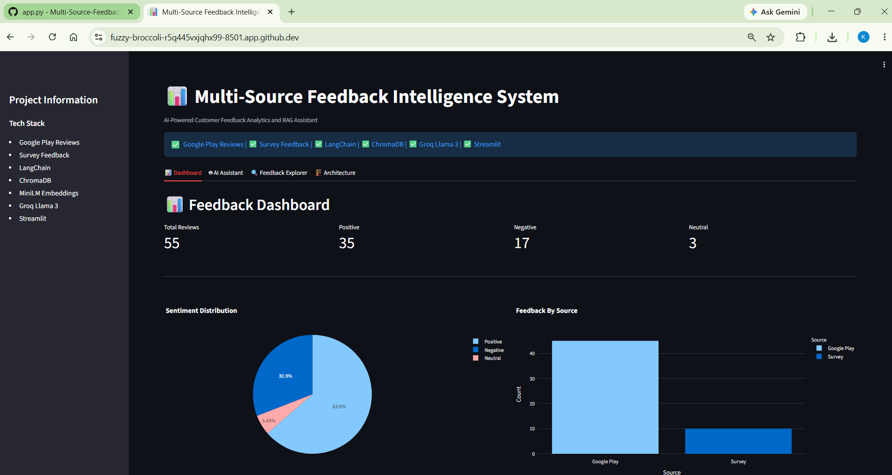
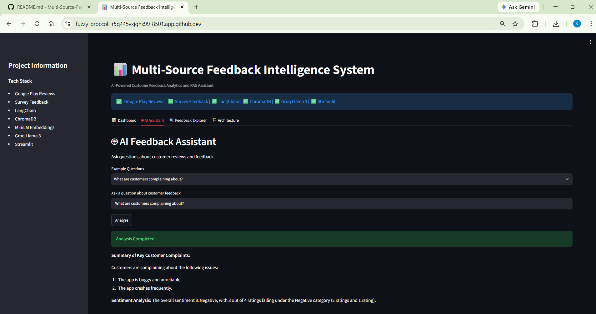
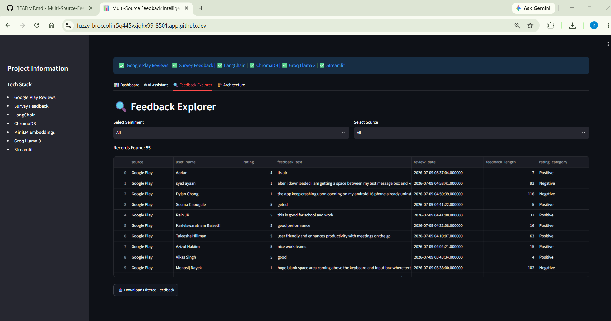
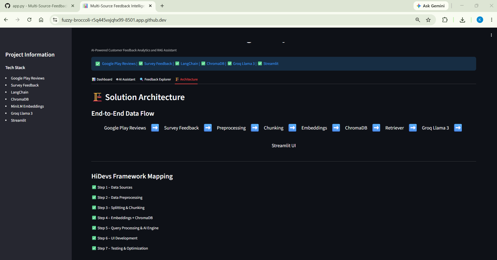

# 📊 Multi-Source Feedback Intelligence System

AI-Powered Customer Feedback Analytics and Retrieval-Augmented Generation (RAG) Platform

---

## 📌 Project Overview

The Multi-Source Feedback Intelligence System is an end-to-end GenAI application that collects customer feedback from multiple sources, processes and analyzes the data, stores semantic embeddings in a vector database, and enables users to query customer insights through an AI-powered assistant.

The system leverages Retrieval-Augmented Generation (RAG) to provide context-aware answers based on real customer reviews and survey feedback.

---

## 🎯 Problem Statement

Organizations receive customer feedback from multiple channels such as:

- Mobile App Reviews
- Customer Surveys
- Product Feedback Forms

Analyzing large volumes of feedback manually is time-consuming and inefficient.

This project consolidates customer feedback into a single intelligent platform that enables:

- Sentiment Analysis
- Complaint Identification
- Feature Request Discovery
- Customer Insight Generation
- AI-Powered Question Answering

---

## 🏗️ Solution Architecture

### Data Flow

```text
Google Play Reviews
        +
Survey Feedback
        ↓
Data Preprocessing
        ↓
Chunking
        ↓
Embeddings (MiniLM-L6-v2)
        ↓
ChromaDB Vector Store
        ↓
Retriever
        ↓
Groq Llama 3
        ↓
Streamlit User Interface
```

---

## 🚀 Technology Stack

| Component | Technology |
|------------|------------|
| Programming Language | Python |
| Data Processing | Pandas |
| Chunking | LangChain RecursiveCharacterTextSplitter |
| Embeddings | all-MiniLM-L6-v2 |
| Vector Database | ChromaDB |
| Framework | LangChain |
| LLM | Groq Llama 3 |
| User Interface | Streamlit |
| Visualization | Plotly |
| Version Control | GitHub |

---

## ✅ HiDevs Framework Implementation

### Step 1 - Data Sources

Implemented:

- Google Play Reviews API
- Survey CSV Feedback

Output:

```text
master_feedback.csv
```

---

### Step 2 - Data Preprocessing

Performed:

- Null Removal
- Duplicate Removal
- Text Normalization
- Sentiment Categorization

Output:

```text
cleaned_feedback.csv
```

---

### Step 3 - Splitting and Chunking

The RecursiveCharacterTextSplitter was selected based on the HiDevs recommendation that it is a general-purpose splitter capable of maintaining semantic coherence across document types.

Configuration:

```python
chunk_size = 500
chunk_overlap = 100
```

Since customer reviews are short, most reviews resulted in a one-to-one mapping between documents and chunks.

---

### Step 4 - Embeddings and Knowledge Base

Implemented:

- MiniLM-L6-v2 Embeddings
- ChromaDB Vector Storage

Output:

```text
55 Documents
↓
55 Chunks
↓
55 Embeddings
↓
Knowledge Base
```

---

### Step 5 - Query Processing and AI Engine

User questions are processed through a Retrieval-Augmented Generation (RAG) pipeline.

Pipeline:

```text
User Query
↓
Retriever
↓
ChromaDB
↓
Prompt Template
↓
Groq Llama 3
↓
Response
```

Examples:

```text
What are customers complaining about?

What login related issues are customers reporting?

Summarize negative feedback from customers.

What product improvements should the team prioritize?
```

---

### Step 6 - UI Development

Developed using Streamlit.

Features:

✅ Dashboard

✅ AI Assistant

✅ Feedback Explorer

✅ Architecture View

---

### Step 7 - Testing and Optimization

Implemented:

- Functional Testing
- Retrieval Testing
- RAG Evaluation
- Dashboard Validation

Detailed test cases can be found here:

```text
tests/test_cases.md
```

---

## 🖥️ Application Screens

### Dashboard

Features:

- KPI Cards
- Sentiment Distribution
- Source Distribution
- Quick Insights

> 

---

### AI Feedback Assistant

Features:

- Natural Language Questions
- ChromaDB Retrieval
- Groq Llama 3 Response Generation

> 
---

### Feedback Explorer

Features:

- Sentiment Filtering
- Source Filtering
- CSV Download

> 
---

### Architecture

Shows complete end-to-end solution flow.

> 
---

## ⚙️ Installation

Clone the repository:

```bash
git clone <YOUR_GITHUB_URL>
```

Move into the project folder:

```bash
cd feedback_intelligence_multi_source_hidevs
```

Install dependencies:

```bash
pip install -r requirements.txt
```

---

## 🔑 API Configuration

Create:

```text
.env
```

Copy contents from:

```text
.env.example
```

and replace:

```env
GROQ_API_KEY=your_groq_api_key_here
```

with your own Groq API key.

---

## ▶️ Running the Application

Run Streamlit